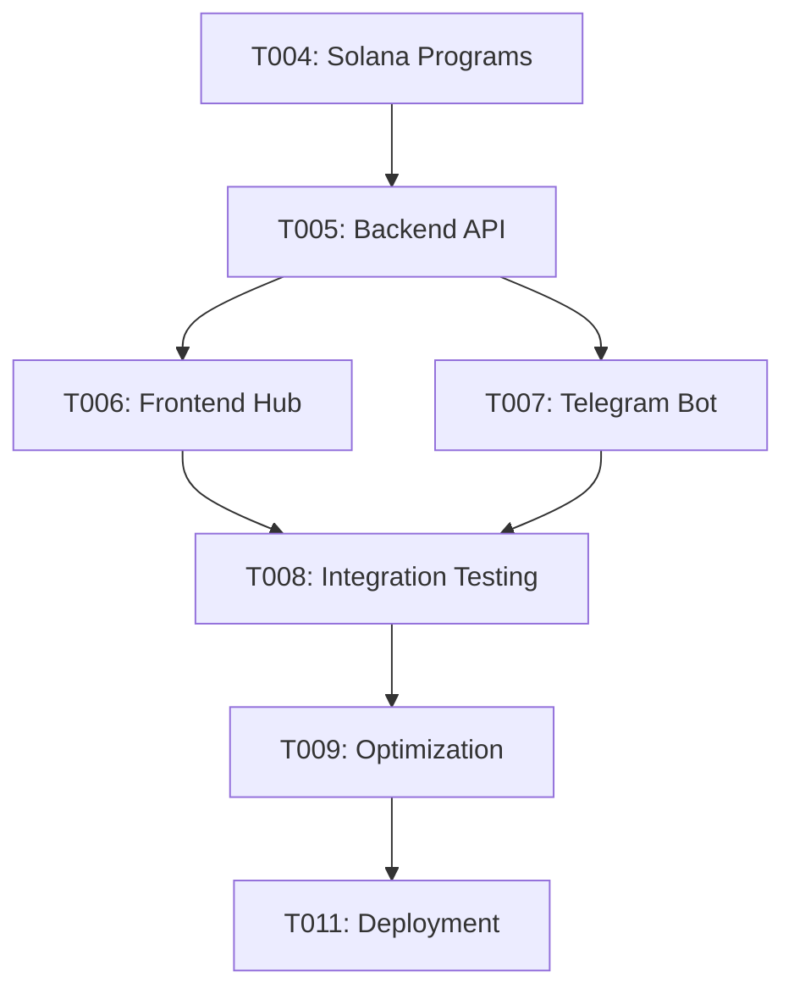

# 📋 TASKS.md - Decentralized Raffle Hub v4

**Project**: Complete Raffle Ecosystem Development  
**Timeline**: Q1 2025  
**Status**: 🚧 Phase 2 - Core Development

## 🎯 CURRENT SPRINT - Phase 2: Core Functionality

### HIGH PRIORITY TASKS 🔴

#### ✅ COMPLETED
- [x] **T001**: Project structure analysis and v4 setup
- [x] **T002**: Comprehensive project documentation creation
- [x] **T003**: Technology stack assessment and planning

#### 🔄 IN PROGRESS
- [ ] **T004**: Enhanced Solana program architecture design
  - **Status**: Planning
  - **Assignee**: Core Dev Team
  - **Deadline**: Week 1
  - **Dependencies**: None
  - **Details**: Design VRF-based raffle programs with PDA escrow accounts

#### 📋 PENDING
- [ ] **T005**: Backend API implementation
  - **Status**: Not Started
  - **Priority**: High
  - **Estimated**: 2 weeks
  - **Subtasks**:
    - [ ] T005a: Database schema refinement
    - [ ] T005b: Authentication endpoints
    - [ ] T005c: Raffle management APIs
    - [ ] T005d: Payment processing integration
    - [ ] T005e: WebSocket real-time updates

- [ ] **T006**: Frontend raffle hub development
  - **Status**: Not Started
  - **Priority**: High
  - **Estimated**: 3 weeks
  - **Subtasks**:
    - [ ] T006a: Next.js project setup with shadcn/ui
    - [ ] T006b: Wallet connection implementation
    - [ ] T006c: Raffle browsing interface
    - [ ] T006d: Ticket purchase flow
    - [ ] T006e: Live draw visualization

- [ ] **T007**: Telegram bot enhancement
  - **Status**: Not Started
  - **Priority**: Medium
  - **Estimated**: 1.5 weeks
  - **Subtasks**:
    - [ ] T007a: API integration layer
    - [ ] T007b: Raffle announcement system
    - [ ] T007c: Ticket purchase commands
    - [ ] T007d: Dramatic draw narration
    - [ ] T007e: User query handling

### MEDIUM PRIORITY TASKS 🟡

- [ ] **T008**: System integration testing
  - **Status**: Not Started
  - **Priority**: Medium
  - **Estimated**: 1 week
  - **Dependencies**: T004, T005, T006, T007

- [ ] **T009**: Performance optimization
  - **Status**: Not Started
  - **Priority**: Medium
  - **Estimated**: 1 week
  - **Dependencies**: T008

- [ ] **T010**: Security audit and testing
  - **Status**: Not Started
  - **Priority**: Medium
  - **Estimated**: 1 week
  - **Dependencies**: T008

### LOW PRIORITY TASKS 🟢

- [ ] **T011**: Deployment pipeline setup
  - **Status**: Not Started
  - **Priority**: Low
  - **Estimated**: 0.5 weeks

- [ ] **T012**: Monitoring and alerting
  - **Status**: Not Started
  - **Priority**: Low
  - **Estimated**: 0.5 weeks

- [ ] **T013**: Documentation completion
  - **Status**: Not Started
  - **Priority**: Low
  - **Estimated**: 0.5 weeks

## 📊 TASK BREAKDOWN BY COMPONENT

### 🔗 Solana Programs (25% of effort)
| Task | Status | Priority | Estimated |
|------|--------|----------|-----------|
| T004 | 🔄 In Progress | High | 1 week |
| VRF Integration | 📋 Pending | High | 1 week |
| PDA Escrow Logic | 📋 Pending | High | 1 week |
| Testing Suite | 📋 Pending | Medium | 1 week |

### 🖥️ Backend API (30% of effort)
| Task | Status | Priority | Estimated |
|------|--------|----------|-----------|
| T005a | 📋 Pending | High | 3 days |
| T005b | 📋 Pending | High | 3 days |
| T005c | 📋 Pending | High | 4 days |
| T005d | 📋 Pending | High | 2 days |
| T005e | 📋 Pending | High | 2 days |

### 🌐 Frontend Hub (30% of effort)
| Task | Status | Priority | Estimated |
|------|--------|----------|-----------|
| T006a | 📋 Pending | High | 2 days |
| T006b | 📋 Pending | High | 3 days |
| T006c | 📋 Pending | High | 5 days |
| T006d | 📋 Pending | High | 4 days |
| T006e | 📋 Pending | High | 3 days |

### 🤖 Telegram Bot (15% of effort)
| Task | Status | Priority | Estimated |
|------|--------|----------|-----------|
| T007a | 📋 Pending | Medium | 2 days |
| T007b | 📋 Pending | Medium | 2 days |
| T007c | 📋 Pending | Medium | 3 days |
| T007d | 📋 Pending | Medium | 2 days |
| T007e | 📋 Pending | Medium | 1 day |

## 🎯 MILESTONES

### Milestone 1: Foundation Complete ✅
- **Date**: January 15, 2025
- **Status**: ✅ Completed
- **Deliverables**:
  - [x] v4 project structure
  - [x] Documentation framework
  - [x] Technology assessment

### Milestone 2: Core Components 🔄
- **Date**: February 1, 2025
- **Status**: 🔄 In Progress
- **Deliverables**:
  - [ ] Functional Solana programs
  - [ ] Complete backend API
  - [ ] Basic frontend interface
  - [ ] Enhanced Telegram bot

### Milestone 3: Integration Complete 📋
- **Date**: February 15, 2025
- **Status**: 📋 Planned
- **Deliverables**:
  - [ ] End-to-end raffle flows
  - [ ] Real-time synchronization
  - [ ] Payment processing
  - [ ] Testing completion

### Milestone 4: Production Ready 📋
- **Date**: March 1, 2025
- **Status**: 📋 Planned
- **Deliverables**:
  - [ ] Deployment pipeline
  - [ ] Performance optimization
  - [ ] Security audit
  - [ ] Documentation

## ⚠️ BLOCKERS & RISKS

### Current Blockers
- None identified

### Potential Risks
1. **VRF Integration Complexity**: ORAO VRF may require additional implementation time
2. **Cross-Component Synchronization**: Real-time updates across all platforms
3. **Solana Network Performance**: Gas costs and transaction speeds
4. **Bot Rate Limiting**: Telegram API limits for high-volume announcements

### Mitigation Strategies
1. **VRF Fallback**: Implement backup randomness source
2. **Event-Driven Architecture**: Use robust message queue system
3. **Transaction Optimization**: Batch operations where possible
4. **Bot Scaling**: Implement message queuing and rate limiting

## 📈 PROGRESS TRACKING

### Overall Progress: 15% Complete
- ✅ Foundation: 100%
- 🔄 Core Development: 5%
- 📋 Integration: 0%
- 📋 Deployment: 0%

### Weekly Progress Reports
- **Week 1 (Jan 15-21)**: Foundation setup, documentation, planning
- **Week 2 (Jan 22-28)**: Solana program development begins
- **Week 3 (Jan 29-Feb 4)**: Backend API development
- **Week 4 (Feb 5-11)**: Frontend development begins

## 🔄 TASK DEPENDENCIES



## 📝 TASK TEMPLATES

### New Task Template
```markdown
- [ ] **TXXX**: Task Name
  - **Status**: Not Started
  - **Priority**: High/Medium/Low
  - **Estimated**: X days/weeks
  - **Assignee**: Team Member
  - **Dependencies**: [List of dependent tasks]
  - **Acceptance Criteria**: [List of completion requirements]
  - **Notes**: [Additional context or requirements]
```

---

**Last Updated**: January 15, 2025  
**Next Review**: January 22, 2025  
**Maintained By**: Development Team