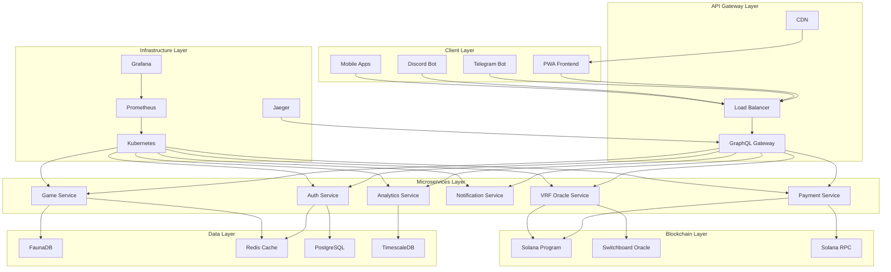
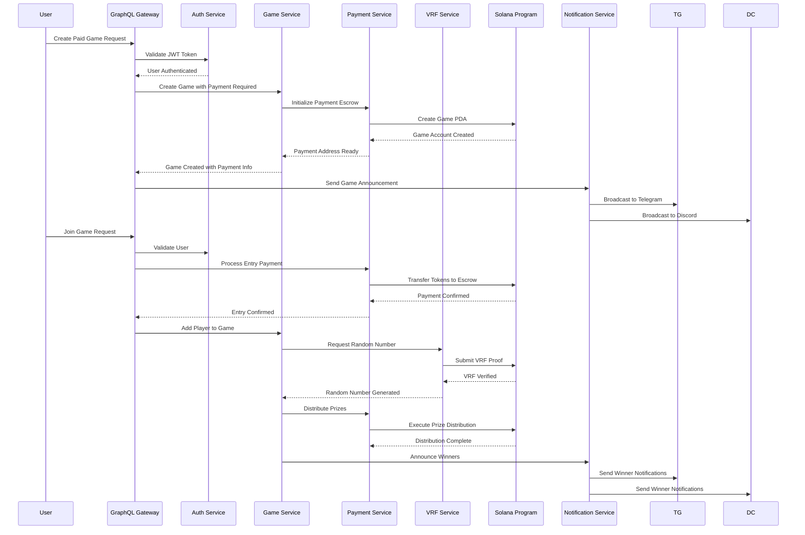
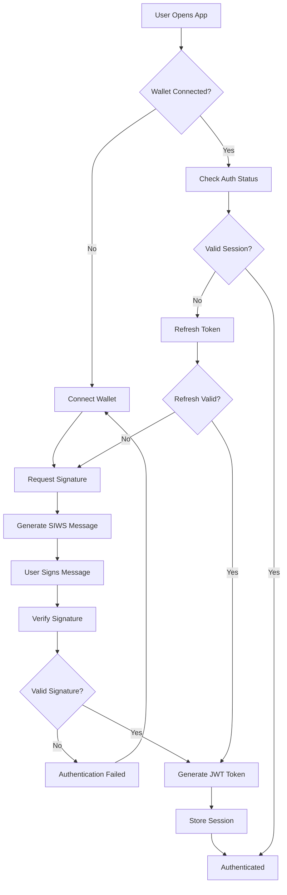
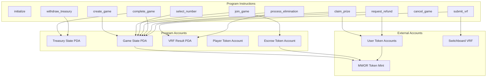
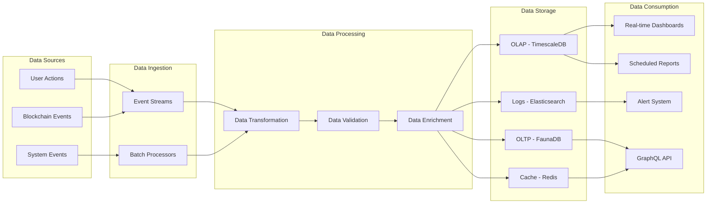
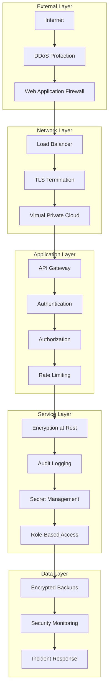
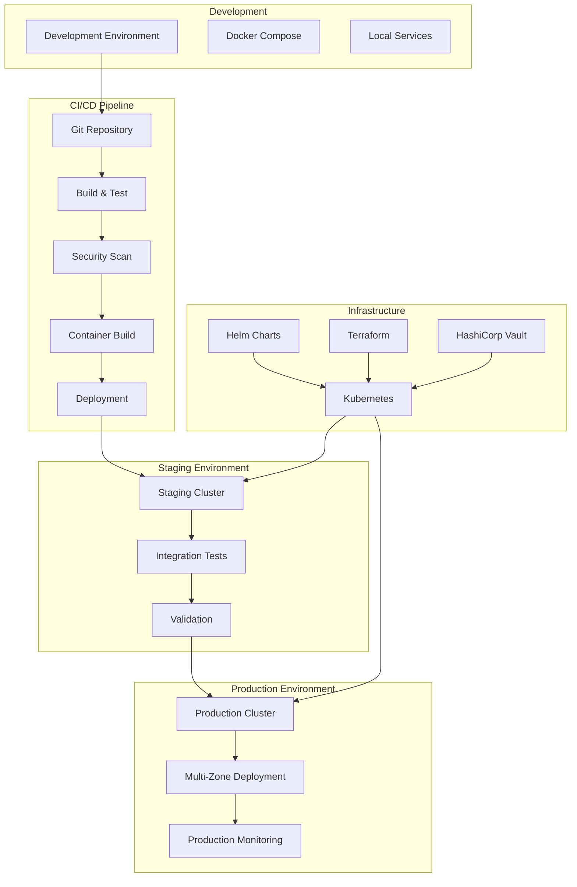
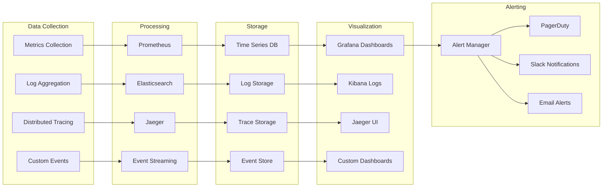

# System Architecture Diagrams

## 1. High-Level System Overview



## 2. Microservices Communication Flow



## 3. GraphQL Federation Schema

```mermaid
graph LR
    subgraph "Gateway Schema"
        UNIFIED[Unified Schema]
    end
    
    subgraph "Auth Subgraph"
        A1[User Entity]
        A2[Session Type]
        A3[Wallet Type]
    end
    
    subgraph "Game Subgraph"
        G1[Game Entity]
        G2[Player Type]
        G3[Round Type]
    end
    
    subgraph "Payment Subgraph"
        P1[Payment Entity]
        P2[Transaction Type]
        P3[Prize Type]
    end
    
    subgraph "Analytics Subgraph"
        AN1[GameAnalytics Type]
        AN2[UserStats Type]
        AN3[SystemMetrics Type]
    end
    
    UNIFIED --> A1
    UNIFIED --> G1
    UNIFIED --> P1
    UNIFIED --> AN1
    
    A1 -.->|@key| G1
    A1 -.->|@key| P1
    G1 -.->|@key| P1
    G1 -.->|@key| AN1
    A1 -.->|@key| AN2
```

## 4. SIWS Authentication Flow



## 5. Solana Program Architecture



## 6. Data Flow Architecture



## 7. Security Architecture



## 8. Deployment Architecture



## 9. Monitoring and Observability



## 10. PWA Architecture

```mermaid
graph TB
    subgraph "PWA Shell"
        SHELL[App Shell]
        SW[Service Worker]
        MANIFEST[Web App Manifest]
    end
    
    subgraph "Frontend Components"
        REACT[React Components]
        ROUTER[React Router]
        STATE[Redux Store]
        CACHE[Apollo Cache]
    end
    
    subgraph "PWA Features"
        OFFLINE[Offline Support]
        PUSH[Push Notifications]
        INSTALL[App Installation]
        BACKGROUND[Background Sync]
    end
    
    subgraph "Device Integration"
        CAMERA[Camera Access]
        STORAGE[Local Storage]
        CRYPTO[Web Crypto API]
        WALLET[Wallet Integration]
    end
    
    subgraph "Platform Adapters"
        WEB[Web Browser]
        MOBILE[Mobile (Capacitor)]
        DESKTOP[Desktop (Electron)]
        TELEGRAM[Telegram Mini App]
    end
    
    SHELL --> REACT
    SW --> OFFLINE
    SW --> PUSH
    SW --> BACKGROUND
    MANIFEST --> INSTALL
    
    REACT --> ROUTER
    ROUTER --> STATE
    STATE --> CACHE
    
    OFFLINE --> STORAGE
    PUSH --> STORAGE
    BACKGROUND --> STORAGE
    
    CRYPTO --> WALLET
    CAMERA --> WALLET
    
    WEB --> SHELL
    MOBILE --> SHELL
    DESKTOP --> SHELL
    TELEGRAM --> SHELL
```

These diagrams provide a comprehensive visual representation of the system architecture, showing how all components interact and the flow of data and control throughout the system.