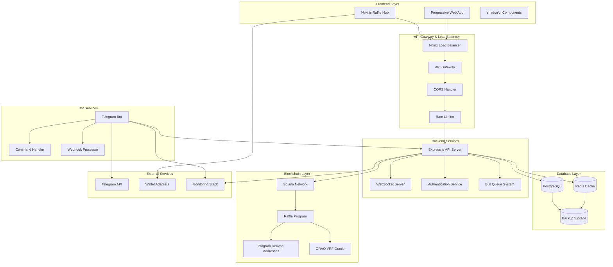

# 🏗️ SPARC Phase 3: Architecture - System Design

**Document Type**: Technical Architecture Specification  
**Phase**: SPARC Phase 3 - Architecture  
**Status**: 🔄 In Progress  
**Created**: January 15, 2025

## 🎯 ARCHITECTURE OVERVIEW

This document defines the complete technical architecture for the Decentralized Raffle Hub v4, translating the specifications and algorithms from previous phases into concrete system design, component interactions, and deployment strategies.

## 🌐 SYSTEM ARCHITECTURE DIAGRAM



## 🔗 SOLANA PROGRAM ARCHITECTURE

### Program Structure and Accounts

```rust
// programs/raffle/src/lib.rs
use anchor_lang::prelude::*;
use orao_solana_vrf::program::OraoVrf;
use orao_solana_vrf::state::NetworkState;

declare_id!("RaffLEHuBv4phYZ7n3RCqEGmEhyPUX9HKE8nGhLfHJKE"); // To be updated on deployment

#[program]
pub mod raffle_program {
    use super::*;

    // Initialize the program
    pub fn initialize_program(
        ctx: Context<InitializeProgram>,
        fee_rate: u16,
        treasury: Pubkey,
    ) -> Result<()> {
        // Implementation will be in Phase 4
    }

    // Create a new raffle
    pub fn create_raffle(
        ctx: Context<CreateRaffle>,
        params: CreateRaffleParams,
    ) -> Result<()> {
        // Implementation will be in Phase 4
    }

    // Purchase a ticket
    pub fn purchase_ticket(
        ctx: Context<PurchaseTicket>,
        raffle_id: u64,
    ) -> Result<()> {
        // Implementation will be in Phase 4
    }

    // Request VRF for winner selection
    pub fn request_winner_selection(
        ctx: Context<RequestWinnerSelection>,
        raffle_id: u64,
    ) -> Result<()> {
        // Implementation will be in Phase 4
    }

    // Fulfill VRF and determine winner
    pub fn fulfill_winner_selection(
        ctx: Context<FulfillWinnerSelection>,
        raffle_id: u64,
    ) -> Result<()> {
        // Implementation will be in Phase 4
    }

    // Distribute prizes to winner
    pub fn distribute_prize(
        ctx: Context<DistributePrize>,
        raffle_id: u64,
    ) -> Result<()> {
        // Implementation will be in Phase 4
    }

    // Cancel raffle and refund tickets
    pub fn cancel_raffle(
        ctx: Context<CancelRaffle>,
        raffle_id: u64,
    ) -> Result<()> {
        // Implementation will be in Phase 4
    }
}

// Account structures
#[account]
pub struct ProgramState {
    pub authority: Pubkey,
    pub treasury: Pubkey,
    pub fee_rate: u16,              // Basis points (100 = 1%)
    pub total_raffles: u64,
    pub total_volume: u64,
    pub is_paused: bool,
    pub bump: u8,
}

#[account]
pub struct RaffleAccount {
    pub id: u64,
    pub creator: Pubkey,
    pub title: String,              // Max 200 chars
    pub description: String,        // Max 1000 chars  
    pub prize_amount: u64,
    pub ticket_price: u64,
    pub max_tickets: u32,
    pub tickets_sold: u32,
    pub start_time: i64,
    pub end_time: i64,
    pub status: RaffleStatus,
    pub escrow_bump: u8,
    pub raffle_bump: u8,
    pub vrf_request: Option<Pubkey>,
    pub winner: Option<Pubkey>,
    pub vrf_proof: Option<[u8; 64]>,
    pub created_at: i64,
    pub drawn_at: Option<i64>,
    pub distributed_at: Option<i64>,
}

#[account]
pub struct TicketAccount {
    pub raffle_id: u64,
    pub owner: Pubkey,
    pub ticket_number: u32,
    pub purchase_time: i64,
    pub bump: u8,
}

#[account]
pub struct EscrowAccount {
    pub raffle_id: u64,
    pub bump: u8,
}

#[derive(AnchorSerialize, AnchorDeserialize, Clone, PartialEq, Eq)]
pub enum RaffleStatus {
    Active,
    Drawing,
    Complete,
    Cancelled,
}

// PDA derivation functions
impl RaffleAccount {
    pub const LEN: usize = 8 + // discriminator
        8 + // id
        32 + // creator
        4 + 200 + // title (String)
        4 + 1000 + // description (String)
        8 + // prize_amount
        8 + // ticket_price
        4 + // max_tickets
        4 + // tickets_sold
        8 + // start_time
        8 + // end_time
        1 + // status
        1 + // escrow_bump
        1 + // raffle_bump
        1 + 32 + // vrf_request (Option<Pubkey>)
        1 + 32 + // winner (Option<Pubkey>)
        1 + 64 + // vrf_proof (Option<[u8; 64]>)
        8 + // created_at
        1 + 8 + // drawn_at (Option<i64>)
        1 + 8; // distributed_at (Option<i64>)

    pub fn find_pda(raffle_id: u64) -> (Pubkey, u8) {
        Pubkey::find_program_address(
            &[
                b"raffle",
                raffle_id.to_le_bytes().as_ref(),
            ],
            &crate::ID,
        )
    }
}

impl EscrowAccount {
    pub fn find_pda(raffle_id: u64) -> (Pubkey, u8) {
        Pubkey::find_program_address(
            &[
                b"escrow",
                raffle_id.to_le_bytes().as_ref(),
            ],
            &crate::ID,
        )
    }
}

impl TicketAccount {
    pub const LEN: usize = 8 + // discriminator
        8 + // raffle_id
        32 + // owner
        4 + // ticket_number
        8 + // purchase_time
        1; // bump

    pub fn find_pda(raffle_id: u64, ticket_number: u32) -> (Pubkey, u8) {
        Pubkey::find_program_address(
            &[
                b"ticket",
                raffle_id.to_le_bytes().as_ref(),
                ticket_number.to_le_bytes().as_ref(),
            ],
            &crate::ID,
        )
    }
}
```

### Instruction Context Structures

```rust
// Context structures for each instruction
#[derive(Accounts)]
pub struct InitializeProgram<'info> {
    #[account(
        init,
        payer = authority,
        space = 8 + ProgramState::LEN,
        seeds = [b"program_state"],
        bump
    )]
    pub program_state: Account<'info, ProgramState>,
    
    #[account(mut)]
    pub authority: Signer<'info>,
    
    pub system_program: Program<'info, System>,
}

#[derive(Accounts)]
#[instruction(params: CreateRaffleParams)]
pub struct CreateRaffle<'info> {
    #[account(
        init,
        payer = creator,
        space = 8 + RaffleAccount::LEN,
        seeds = [
            b"raffle",
            params.raffle_id.to_le_bytes().as_ref()
        ],
        bump
    )]
    pub raffle_account: Account<'info, RaffleAccount>,
    
    #[account(
        init,
        payer = creator,
        space = 8 + EscrowAccount::LEN,
        seeds = [
            b"escrow",
            params.raffle_id.to_le_bytes().as_ref()
        ],
        bump
    )]
    pub escrow_account: Account<'info, EscrowAccount>,
    
    #[account(
        mut,
        seeds = [b"program_state"],
        bump = program_state.bump
    )]
    pub program_state: Account<'info, ProgramState>,
    
    #[account(mut)]
    pub creator: Signer<'info>,
    
    pub system_program: Program<'info, System>,
}

#[derive(Accounts)]
#[instruction(raffle_id: u64)]
pub struct PurchaseTicket<'info> {
    #[account(
        mut,
        seeds = [
            b"raffle",
            raffle_id.to_le_bytes().as_ref()
        ],
        bump = raffle_account.raffle_bump
    )]
    pub raffle_account: Account<'info, RaffleAccount>,
    
    #[account(
        init,
        payer = buyer,
        space = 8 + TicketAccount::LEN,
        seeds = [
            b"ticket",
            raffle_id.to_le_bytes().as_ref(),
            (raffle_account.tickets_sold + 1).to_le_bytes().as_ref()
        ],
        bump
    )]
    pub ticket_account: Account<'info, TicketAccount>,
    
    #[account(
        mut,
        seeds = [
            b"escrow",
            raffle_id.to_le_bytes().as_ref()
        ],
        bump = raffle_account.escrow_bump
    )]
    pub escrow_account: Account<'info, EscrowAccount>,
    
    #[account(mut)]
    pub buyer: Signer<'info>,
    
    pub system_program: Program<'info, System>,
}

// Parameter structures
#[derive(AnchorSerialize, AnchorDeserialize, Clone)]
pub struct CreateRaffleParams {
    pub raffle_id: u64,
    pub title: String,
    pub description: String,
    pub prize_amount: u64,
    pub ticket_price: u64,
    pub max_tickets: u32,
    pub duration: i64,
}
```

## 🖥️ BACKEND API ARCHITECTURE

### Express.js Server Structure

```typescript
// backend/src/app.ts
import express from 'express';
import cors from 'cors';
import helmet from 'helmet';
import compression from 'compression';
import rateLimit from 'express-rate-limit';
import { createServer } from 'http';
import { Server as SocketIOServer } from 'socket.io';

import { authRoutes } from './routes/auth.routes';
import { raffleRoutes } from './routes/raffle.routes';
import { ticketRoutes } from './routes/ticket.routes';
import { userRoutes } from './routes/user.routes';
import { statsRoutes } from './routes/stats.routes';

import { errorHandler } from './middleware/error.middleware';
import { authMiddleware } from './middleware/auth.middleware';
import { validationMiddleware } from './middleware/validation.middleware';

class RaffleHubServer {
    private app: express.Application;
    private server: any;
    private io: SocketIOServer;

    constructor() {
        this.app = express();
        this.server = createServer(this.app);
        this.io = new SocketIOServer(this.server, {
            cors: {
                origin: process.env.FRONTEND_URL,
                methods: ["GET", "POST"]
            }
        });
        
        this.configureMiddleware();
        this.configureRoutes();
        this.configureWebSocket();
        this.configureErrorHandling();
    }

    private configureMiddleware(): void {
        // Security middleware
        this.app.use(helmet({
            contentSecurityPolicy: {
                directives: {
                    defaultSrc: ["'self'"],
                    styleSrc: ["'self'", "'unsafe-inline'"],
                    scriptSrc: ["'self'"],
                    imgSrc: ["'self'", "data:", "https:"],
                    connectSrc: ["'self'", "wss:", "https:"],
                }
            }
        }));
        
        // CORS configuration
        this.app.use(cors({
            origin: [
                process.env.FRONTEND_URL,
                'http://localhost:3000',
                'https://raffle-hub.vercel.app'
            ],
            credentials: true,
            methods: ['GET', 'POST', 'PUT', 'DELETE', 'OPTIONS'],
            allowedHeaders: ['Content-Type', 'Authorization', 'X-Requested-With']
        }));
        
        // Rate limiting
        const limiter = rateLimit({
            windowMs: 15 * 60 * 1000, // 15 minutes
            max: 100, // 100 requests per windowMs
            message: 'Too many requests from this IP',
            standardHeaders: true,
            legacyHeaders: false,
        });
        this.app.use('/api/', limiter);
        
        // Body parsing
        this.app.use(express.json({ limit: '10mb' }));
        this.app.use(express.urlencoded({ extended: true, limit: '10mb' }));
        
        // Compression
        this.app.use(compression());
        
        // Request logging
        this.app.use((req, res, next) => {
            console.log(`${new Date().toISOString()} - ${req.method} ${req.path}`);
            next();
        });
    }

    private configureRoutes(): void {
        // Health check
        this.app.get('/health', (req, res) => {
            res.json({ 
                status: 'ok', 
                timestamp: new Date().toISOString(),
                version: process.env.APP_VERSION || '1.0.0'
            });
        });

        // API routes
        this.app.use('/api/auth', authRoutes);
        this.app.use('/api/raffles', authMiddleware, raffleRoutes);
        this.app.use('/api/tickets', authMiddleware, ticketRoutes);
        this.app.use('/api/users', authMiddleware, userRoutes);
        this.app.use('/api/stats', statsRoutes);
        
        // 404 handler
        this.app.use('*', (req, res) => {
            res.status(404).json({ 
                error: 'Route not found',
                path: req.originalUrl 
            });
        });
    }

    private configureWebSocket(): void {
        this.io.on('connection', (socket) => {
            console.log(`WebSocket connected: ${socket.id}`);
            
            // Join raffle-specific rooms
            socket.on('join_raffle', (raffleId: string) => {
                socket.join(`raffle_${raffleId}`);
                console.log(`Socket ${socket.id} joined raffle_${raffleId}`);
            });
            
            // Leave raffle rooms
            socket.on('leave_raffle', (raffleId: string) => {
                socket.leave(`raffle_${raffleId}`);
                console.log(`Socket ${socket.id} left raffle_${raffleId}`);
            });
            
            // Handle disconnection
            socket.on('disconnect', () => {
                console.log(`WebSocket disconnected: ${socket.id}`);
            });
        });
        
        // Make io available globally for broadcasting
        (global as any).io = this.io;
    }

    private configureErrorHandling(): void {
        this.app.use(errorHandler);
    }

    public start(port: number): void {
        this.server.listen(port, () => {
            console.log(`🚀 Raffle Hub API Server running on port ${port}`);
            console.log(`📊 Environment: ${process.env.NODE_ENV}`);
            console.log(`🔗 WebSocket enabled`);
        });
    }
}

export default RaffleHubServer;
```

### Database Schema and Models

```sql
-- backend/migrations/001_initial_schema.sql

-- Enable UUID extension
CREATE EXTENSION IF NOT EXISTS "uuid-ossp";
CREATE EXTENSION IF NOT EXISTS "pgcrypto";

-- Users table
CREATE TABLE users (
    id UUID PRIMARY KEY DEFAULT uuid_generate_v4(),
    wallet_address VARCHAR(44) UNIQUE NOT NULL,
    telegram_id BIGINT UNIQUE,
    display_name VARCHAR(100),
    email VARCHAR(255),
    avatar_url TEXT,
    notification_preferences JSONB DEFAULT '{
        "email": true,
        "telegram": true,
        "push": true,
        "winner_announcements": true,
        "raffle_updates": true
    }'::jsonb,
    total_spent BIGINT DEFAULT 0,
    total_won BIGINT DEFAULT 0,
    total_tickets INTEGER DEFAULT 0,
    win_count INTEGER DEFAULT 0,
    created_at TIMESTAMP WITH TIME ZONE DEFAULT NOW(),
    updated_at TIMESTAMP WITH TIME ZONE DEFAULT NOW(),
    last_activity TIMESTAMP WITH TIME ZONE DEFAULT NOW()
);

-- Raffles table
CREATE TABLE raffles (
    id UUID PRIMARY KEY DEFAULT uuid_generate_v4(),
    blockchain_id BIGINT UNIQUE NOT NULL,
    creator_id UUID REFERENCES users(id) ON DELETE SET NULL,
    title VARCHAR(200) NOT NULL,
    description TEXT,
    image_url TEXT,
    prize_amount BIGINT NOT NULL,
    ticket_price BIGINT NOT NULL,
    max_tickets INTEGER NOT NULL,
    tickets_sold INTEGER DEFAULT 0,
    start_time TIMESTAMP WITH TIME ZONE NOT NULL,
    end_time TIMESTAMP WITH TIME ZONE NOT NULL,
    status VARCHAR(20) DEFAULT 'active' CHECK (status IN ('active', 'drawing', 'complete', 'cancelled')),
    winner_id UUID REFERENCES users(id) ON DELETE SET NULL,
    winning_ticket_number INTEGER,
    vrf_proof TEXT,
    blockchain_signature VARCHAR(88),
    metadata JSONB DEFAULT '{}'::jsonb,
    created_at TIMESTAMP WITH TIME ZONE DEFAULT NOW(),
    updated_at TIMESTAMP WITH TIME ZONE DEFAULT NOW(),
    drawn_at TIMESTAMP WITH TIME ZONE,
    distributed_at TIMESTAMP WITH TIME ZONE
);

-- Tickets table
CREATE TABLE tickets (
    id UUID PRIMARY KEY DEFAULT uuid_generate_v4(),
    raffle_id UUID REFERENCES raffles(id) ON DELETE CASCADE,
    owner_id UUID REFERENCES users(id) ON DELETE CASCADE,
    ticket_number INTEGER NOT NULL,
    blockchain_signature VARCHAR(88) UNIQUE NOT NULL,
    purchase_price BIGINT NOT NULL,
    purchased_at TIMESTAMP WITH TIME ZONE DEFAULT NOW(),
    UNIQUE(raffle_id, ticket_number),
    UNIQUE(raffle_id, owner_id, ticket_number)
);

-- Transactions table
CREATE TABLE transactions (
    id UUID PRIMARY KEY DEFAULT uuid_generate_v4(),
    user_id UUID REFERENCES users(id) ON DELETE CASCADE,
    raffle_id UUID REFERENCES raffles(id) ON DELETE SET NULL,
    type VARCHAR(20) NOT NULL CHECK (type IN ('purchase', 'win', 'refund', 'fee')),
    amount BIGINT NOT NULL,
    signature VARCHAR(88) UNIQUE NOT NULL,
    block_height BIGINT,
    metadata JSONB DEFAULT '{}'::jsonb,
    created_at TIMESTAMP WITH TIME ZONE DEFAULT NOW()
);

-- Notifications table
CREATE TABLE notifications (
    id UUID PRIMARY KEY DEFAULT uuid_generate_v4(),
    user_id UUID REFERENCES users(id) ON DELETE CASCADE,
    type VARCHAR(50) NOT NULL,
    title VARCHAR(200) NOT NULL,
    message TEXT NOT NULL,
    data JSONB DEFAULT '{}'::jsonb,
    read_at TIMESTAMP WITH TIME ZONE,
    sent_at TIMESTAMP WITH TIME ZONE,
    created_at TIMESTAMP WITH TIME ZONE DEFAULT NOW()
);

-- Platform stats table
CREATE TABLE platform_stats (
    id UUID PRIMARY KEY DEFAULT uuid_generate_v4(),
    date DATE UNIQUE NOT NULL DEFAULT CURRENT_DATE,
    total_raffles INTEGER DEFAULT 0,
    active_raffles INTEGER DEFAULT 0,
    total_tickets INTEGER DEFAULT 0,
    total_volume BIGINT DEFAULT 0,
    total_fees BIGINT DEFAULT 0,
    unique_participants INTEGER DEFAULT 0,
    avg_raffle_duration INTERVAL,
    created_at TIMESTAMP WITH TIME ZONE DEFAULT NOW()
);

-- Indexes for performance
CREATE INDEX idx_users_wallet_address ON users(wallet_address);
CREATE INDEX idx_users_telegram_id ON users(telegram_id);
CREATE INDEX idx_raffles_status ON raffles(status);
CREATE INDEX idx_raffles_end_time ON raffles(end_time);
CREATE INDEX idx_raffles_creator_id ON raffles(creator_id);
CREATE INDEX idx_tickets_raffle_id ON tickets(raffle_id);
CREATE INDEX idx_tickets_owner_id ON tickets(owner_id);
CREATE INDEX idx_transactions_user_id ON transactions(user_id);
CREATE INDEX idx_transactions_signature ON transactions(signature);
CREATE INDEX idx_notifications_user_id ON notifications(user_id);
CREATE INDEX idx_notifications_read_at ON notifications(read_at);

-- Functions for automatic timestamp updates
CREATE OR REPLACE FUNCTION update_updated_at_column()
RETURNS TRIGGER AS $$
BEGIN
    NEW.updated_at = NOW();
    RETURN NEW;
END;
$$ language 'plpgsql';

-- Triggers for updated_at
CREATE TRIGGER update_users_updated_at BEFORE UPDATE ON users FOR EACH ROW EXECUTE FUNCTION update_updated_at_column();
CREATE TRIGGER update_raffles_updated_at BEFORE UPDATE ON raffles FOR EACH ROW EXECUTE FUNCTION update_updated_at_column();

-- Function to update user statistics
CREATE OR REPLACE FUNCTION update_user_stats()
RETURNS TRIGGER AS $$
BEGIN
    -- Update user stats when tickets are purchased or prizes are won
    IF TG_OP = 'INSERT' THEN
        IF NEW.type = 'purchase' THEN
            UPDATE users SET 
                total_spent = total_spent + NEW.amount,
                total_tickets = total_tickets + 1,
                last_activity = NOW()
            WHERE id = NEW.user_id;
        ELSIF NEW.type = 'win' THEN
            UPDATE users SET 
                total_won = total_won + NEW.amount,
                win_count = win_count + 1,
                last_activity = NOW()
            WHERE id = NEW.user_id;
        END IF;
    END IF;
    RETURN COALESCE(NEW, OLD);
END;
$$ language 'plpgsql';

CREATE TRIGGER update_user_stats_trigger 
    AFTER INSERT ON transactions 
    FOR EACH ROW EXECUTE FUNCTION update_user_stats();
```

### API Route Specifications

```typescript
// backend/src/routes/raffle.routes.ts
import { Router } from 'express';
import { body, param, query } from 'express-validator';
import { RaffleController } from '../controllers/raffle.controller';
import { validationMiddleware } from '../middleware/validation.middleware';
import { authMiddleware } from '../middleware/auth.middleware';

const router = Router();
const raffleController = new RaffleController();

// GET /api/raffles - List raffles with filtering and pagination
router.get('/',
    [
        query('page').optional().isInt({ min: 1 }),
        query('limit').optional().isInt({ min: 1, max: 100 }),
        query('status').optional().isIn(['active', 'drawing', 'complete', 'cancelled']),
        query('sort').optional().isIn(['created_at', 'end_time', 'prize_amount', 'tickets_remaining']),
        query('order').optional().isIn(['asc', 'desc']),
        query('min_prize').optional().isInt({ min: 0 }),
        query('max_ticket_price').optional().isInt({ min: 0 }),
        query('creator').optional().isUUID(),
        validationMiddleware
    ],
    raffleController.listRaffles
);

// GET /api/raffles/:id - Get raffle details
router.get('/:id',
    [
        param('id').isUUID(),
        validationMiddleware
    ],
    raffleController.getRaffle
);

// POST /api/raffles - Create new raffle
router.post('/',
    [
        body('title').isLength({ min: 1, max: 200 }).trim(),
        body('description').optional().isLength({ max: 1000 }).trim(),
        body('prize_amount').isInt({ min: 100000000 }), // Minimum 0.1 SOL
        body('ticket_price').isInt({ min: 1000000 }), // Minimum 0.001 SOL
        body('max_tickets').isInt({ min: 1, max: 10000 }),
        body('duration').isInt({ min: 3600, max: 2592000 }), // 1 hour to 30 days
        body('blockchain_signature').isLength({ min: 88, max: 88 }),
        validationMiddleware
    ],
    raffleController.createRaffle
);

// PUT /api/raffles/:id - Update raffle (creator only)
router.put('/:id',
    [
        param('id').isUUID(),
        body('title').optional().isLength({ min: 1, max: 200 }).trim(),
        body('description').optional().isLength({ max: 1000 }).trim(),
        validationMiddleware
    ],
    raffleController.updateRaffle
);

// DELETE /api/raffles/:id - Cancel raffle (creator only)
router.delete('/:id',
    [
        param('id').isUUID(),
        body('blockchain_signature').isLength({ min: 88, max: 88 }),
        validationMiddleware
    ],
    raffleController.cancelRaffle
);

// GET /api/raffles/:id/tickets - Get raffle tickets
router.get('/:id/tickets',
    [
        param('id').isUUID(),
        query('page').optional().isInt({ min: 1 }),
        query('limit').optional().isInt({ min: 1, max: 100 }),
        validationMiddleware
    ],
    raffleController.getRaffleTickets
);

// POST /api/raffles/:id/tickets - Purchase ticket
router.post('/:id/tickets',
    [
        param('id').isUUID(),
        body('blockchain_signature').isLength({ min: 88, max: 88 }),
        validationMiddleware
    ],
    raffleController.purchaseTicket
);

// GET /api/raffles/:id/winner - Get raffle winner
router.get('/:id/winner',
    [
        param('id').isUUID(),
        validationMiddleware
    ],
    raffleController.getRaffleWinner
);

export { router as raffleRoutes };
```

## 🌐 FRONTEND ARCHITECTURE

### Next.js App Structure

```typescript
// frontend/src/app/layout.tsx
import type { Metadata } from 'next';
import { Inter } from 'next/font/google';
import { Providers } from '@/components/providers/Providers';
import { Toaster } from '@/components/ui/toaster';
import '@/styles/globals.css';

const inter = Inter({ subsets: ['latin'] });

export const metadata: Metadata = {
    title: 'Raffle Hub - Decentralized Raffles on Solana',
    description: 'Participate in transparent, verifiable raffles powered by Solana blockchain and VRF technology.',
    keywords: ['raffle', 'lottery', 'solana', 'blockchain', 'vrf', 'decentralized'],
    authors: [{ name: 'Raffle Hub Team' }],
    openGraph: {
        title: 'Raffle Hub - Decentralized Raffles',
        description: 'Transparent, verifiable raffles on Solana',
        type: 'website',
        locale: 'en_US',
    },
    twitter: {
        card: 'summary_large_image',
        title: 'Raffle Hub - Decentralized Raffles',
        description: 'Transparent, verifiable raffles on Solana',
    },
};

interface RootLayoutProps {
    children: React.ReactNode;
}

export default function RootLayout({ children }: RootLayoutProps) {
    return (
        <html lang="en" suppressHydrationWarning>
            <body className={inter.className}>
                <Providers>
                    {children}
                    <Toaster />
                </Providers>
            </body>
        </html>
    );
}
```

### Component Architecture

```typescript
// frontend/src/components/providers/Providers.tsx
'use client';

import { WalletProvider } from './WalletProvider';
import { SocketProvider } from './SocketProvider';
import { QueryProvider } from './QueryProvider';
import { ThemeProvider } from './ThemeProvider';
import { AuthProvider } from './AuthProvider';

interface ProvidersProps {
    children: React.ReactNode;
}

export function Providers({ children }: ProvidersProps) {
    return (
        <ThemeProvider attribute="class" defaultTheme="dark" enableSystem>
            <QueryProvider>
                <WalletProvider>
                    <SocketProvider>
                        <AuthProvider>
                            {children}
                        </AuthProvider>
                    </SocketProvider>
                </WalletProvider>
            </QueryProvider>
        </ThemeProvider>
    );
}

// frontend/src/components/raffle/RaffleCard.tsx
'use client';

import { useState } from 'react';
import { Clock, Users, Trophy, Zap } from 'lucide-react';
import { Card, CardContent, CardFooter, CardHeader } from '@/components/ui/card';
import { Button } from '@/components/ui/button';
import { Badge } from '@/components/ui/badge';
import { Progress } from '@/components/ui/progress';
import { useTicketPurchase } from '@/hooks/useTicketPurchase';
import { formatSOL, formatTimeRemaining } from '@/lib/utils';
import type { Raffle } from '@/types/raffle';

interface RaffleCardProps {
    raffle: Raffle;
    isParticipating: boolean;
    onPurchaseTicket: (raffleId: string) => void;
}

export function RaffleCard({ raffle, isParticipating, onPurchaseTicket }: RaffleCardProps) {
    const [isHovered, setIsHovered] = useState(false);
    const { purchaseTicket, isLoading } = useTicketPurchase();
    
    const timeRemaining = Math.max(0, raffle.endTime - Date.now());
    const fillPercentage = (raffle.ticketsSold / raffle.maxTickets) * 100;
    const isEndingSoon = timeRemaining < 3600000; // 1 hour
    const isNearlyFull = fillPercentage > 80;
    
    const cardVariant = isEndingSoon && isNearlyFull ? 'urgent' : 
                       isEndingSoon ? 'ending-soon' : 
                       isNearlyFull ? 'nearly-full' : 'default';

    const handlePurchase = async () => {
        try {
            await purchaseTicket(raffle.id);
            onPurchaseTicket(raffle.id);
        } catch (error) {
            console.error('Purchase failed:', error);
        }
    };

    return (
        <Card 
            className={`
                relative overflow-hidden transition-all duration-300 hover:shadow-lg
                ${cardVariant === 'urgent' ? 'border-red-500 bg-red-50 dark:bg-red-950/20' : ''}
                ${cardVariant === 'ending-soon' ? 'border-yellow-500 bg-yellow-50 dark:bg-yellow-950/20' : ''}
                ${cardVariant === 'nearly-full' ? 'border-blue-500 bg-blue-50 dark:bg-blue-950/20' : ''}
                ${isParticipating ? 'ring-2 ring-green-500' : ''}
            `}
            onMouseEnter={() => setIsHovered(true)}
            onMouseLeave={() => setIsHovered(false)}
        >
            {/* Status indicators */}
            <div className="absolute top-4 right-4 flex gap-2">
                {isEndingSoon && (
                    <Badge variant="destructive" className="animate-pulse">
                        <Clock className="w-3 h-3 mr-1" />
                        Ending Soon
                    </Badge>
                )}
                {isNearlyFull && (
                    <Badge variant="secondary">
                        <Zap className="w-3 h-3 mr-1" />
                        Nearly Full
                    </Badge>
                )}
                {isParticipating && (
                    <Badge variant="outline" className="bg-green-100 text-green-800">
                        Participating
                    </Badge>
                )}
            </div>

            <CardHeader className="pb-3">
                <div className="flex items-start justify-between">
                    <div className="flex-1 pr-4">
                        <h3 className="font-semibold text-lg line-clamp-2 mb-1">
                            {raffle.title}
                        </h3>
                        <p className="text-sm text-muted-foreground line-clamp-2">
                            {raffle.description}
                        </p>
                    </div>
                </div>
            </CardHeader>

            <CardContent className="space-y-4">
                {/* Prize amount */}
                <div className="flex items-center justify-between">
                    <div className="flex items-center gap-2">
                        <Trophy className="w-4 h-4 text-yellow-500" />
                        <span className="text-sm font-medium">Prize Pool</span>
                    </div>
                    <span className="font-bold text-lg">
                        {formatSOL(raffle.prizeAmount)} SOL
                    </span>
                </div>

                {/* Ticket info */}
                <div className="flex items-center justify-between">
                    <div className="flex items-center gap-2">
                        <Users className="w-4 h-4 text-blue-500" />
                        <span className="text-sm font-medium">Participants</span>
                    </div>
                    <span className="text-sm">
                        {raffle.ticketsSold} / {raffle.maxTickets}
                    </span>
                </div>

                {/* Progress bar */}
                <div className="space-y-2">
                    <Progress value={fillPercentage} className="h-2" />
                    <div className="flex justify-between text-xs text-muted-foreground">
                        <span>{fillPercentage.toFixed(1)}% filled</span>
                        <span>{raffle.maxTickets - raffle.ticketsSold} tickets left</span>
                    </div>
                </div>

                {/* Time remaining */}
                <div className="flex items-center justify-between">
                    <div className="flex items-center gap-2">
                        <Clock className="w-4 h-4 text-orange-500" />
                        <span className="text-sm font-medium">Time Remaining</span>
                    </div>
                    <span className={`text-sm font-mono ${isEndingSoon ? 'text-red-500' : ''}`}>
                        {formatTimeRemaining(timeRemaining)}
                    </span>
                </div>

                {/* Ticket price */}
                <div className="flex items-center justify-between pt-2 border-t">
                    <span className="text-sm font-medium">Ticket Price</span>
                    <span className="font-semibold">
                        {formatSOL(raffle.ticketPrice)} SOL
                    </span>
                </div>
            </CardContent>

            <CardFooter className="pt-3">
                <Button
                    onClick={handlePurchase}
                    disabled={isLoading || timeRemaining === 0 || raffle.ticketsSold >= raffle.maxTickets}
                    className="w-full"
                    variant={cardVariant === 'urgent' ? 'destructive' : 'default'}
                >
                    {isLoading ? (
                        'Processing...'
                    ) : timeRemaining === 0 ? (
                        'Raffle Ended'
                    ) : raffle.ticketsSold >= raffle.maxTickets ? (
                        'Sold Out'
                    ) : isParticipating ? (
                        'Buy Another Ticket'
                    ) : (
                        'Buy Ticket'
                    )}
                </Button>
            </CardFooter>

            {/* Hover effect overlay */}
            {isHovered && (
                <div className="absolute inset-0 bg-gradient-to-r from-transparent via-white/5 to-transparent -skew-x-12 animate-shimmer" />
            )}
        </Card>
    );
}
```

## 🤖 TELEGRAM BOT ARCHITECTURE

### Bot Command Structure

```typescript
// bot/src/bot.ts
import { Telegraf, Context } from 'telegraf';
import { message } from 'telegraf/filters';
import { CommandHandler } from './handlers/CommandHandler';
import { CallbackHandler } from './handlers/CallbackHandler';
import { APIClient } from './services/APIClient';
import { MessageFormatter } from './utils/MessageFormatter';

interface BotContext extends Context {
    session?: {
        userId?: string;
        walletAddress?: string;
        activeRaffle?: string;
    };
}

class RaffleBot {
    private bot: Telegraf<BotContext>;
    private commandHandler: CommandHandler;
    private callbackHandler: CallbackHandler;
    private apiClient: APIClient;

    constructor() {
        this.bot = new Telegraf<BotContext>(process.env.BOT_TOKEN!);
        this.apiClient = new APIClient(process.env.API_BASE_URL!);
        this.commandHandler = new CommandHandler(this.apiClient);
        this.callbackHandler = new CallbackHandler(this.apiClient);
        
        this.setupMiddleware();
        this.setupCommands();
        this.setupCallbacks();
        this.setupErrorHandling();
    }

    private setupMiddleware(): void {
        // Session middleware
        this.bot.use((ctx, next) => {
            ctx.session = ctx.session || {};
            return next();
        });

        // Logging middleware
        this.bot.use((ctx, next) => {
            const userId = ctx.from?.id;
            const username = ctx.from?.username || 'unknown';
            const action = ctx.message ? 'message' : ctx.callbackQuery ? 'callback' : 'unknown';
            
            console.log(`[${new Date().toISOString()}] User ${userId} (${username}) - ${action}`);
            return next();
        });

        // Rate limiting middleware
        const userLastAction = new Map<number, number>();
        this.bot.use((ctx, next) => {
            const userId = ctx.from?.id;
            if (!userId) return next();

            const now = Date.now();
            const lastAction = userLastAction.get(userId) || 0;
            
            if (now - lastAction < 1000) { // 1 second cooldown
                return ctx.reply('⏳ Please wait a moment before sending another command.');
            }
            
            userLastAction.set(userId, now);
            return next();
        });
    }

    private setupCommands(): void {
        // Start command
        this.bot.start((ctx) => this.commandHandler.handleStart(ctx));
        
        // Help command
        this.bot.help((ctx) => this.commandHandler.handleHelp(ctx));
        
        // Raffle commands
        this.bot.command('raffles', (ctx) => this.commandHandler.handleListRaffles(ctx));
        this.bot.command('create', (ctx) => this.commandHandler.handleCreateRaffle(ctx));
        this.bot.command('join', (ctx) => this.commandHandler.handleJoinRaffle(ctx));
        this.bot.command('my_tickets', (ctx) => this.commandHandler.handleMyTickets(ctx));
        this.bot.command('winners', (ctx) => this.commandHandler.handleRecentWinners(ctx));
        
        // Wallet commands
        this.bot.command('wallet', (ctx) => this.commandHandler.handleWallet(ctx));
        this.bot.command('connect', (ctx) => this.commandHandler.handleConnectWallet(ctx));
        
        // Admin commands
        this.bot.command('admin', (ctx) => this.commandHandler.handleAdmin(ctx));
        this.bot.command('announce', (ctx) => this.commandHandler.handleAnnounce(ctx));
        
        // Generic message handler for raffle IDs
        this.bot.on(message('text'), (ctx) => {
            const text = ctx.message.text.trim();
            
            // Check if message is a raffle ID or command
            if (text.match(/^[0-9a-f]{8}-[0-9a-f]{4}-[0-9a-f]{4}-[0-9a-f]{4}-[0-9a-f]{12}$/i)) {
                return this.commandHandler.handleRaffleId(ctx, text);
            }
            
            // Default response for unrecognized messages
            return ctx.reply(
                '🤔 I didn\'t understand that command.\n\n' +
                'Use /help to see available commands or send a raffle ID to get details.'
            );
        });
    }

    private setupCallbacks(): void {
        // Raffle interaction callbacks
        this.bot.action(/^raffle_join_(.+)$/, (ctx) => 
            this.callbackHandler.handleJoinRaffle(ctx, ctx.match[1])
        );
        
        this.bot.action(/^raffle_details_(.+)$/, (ctx) => 
            this.callbackHandler.handleRaffleDetails(ctx, ctx.match[1])
        );
        
        this.bot.action(/^raffle_share_(.+)$/, (ctx) => 
            this.callbackHandler.handleShareRaffle(ctx, ctx.match[1])
        );
        
        // Ticket interaction callbacks
        this.bot.action(/^buy_ticket_(.+)$/, (ctx) => 
            this.callbackHandler.handleBuyTicket(ctx, ctx.match[1])
        );
        
        this.bot.action(/^confirm_purchase_(.+)$/, (ctx) => 
            this.callbackHandler.handleConfirmPurchase(ctx, ctx.match[1])
        );
        
        // Navigation callbacks
        this.bot.action('back_to_raffles', (ctx) => 
            this.callbackHandler.handleBackToRaffles(ctx)
        );
        
        this.bot.action('refresh_data', (ctx) => 
            this.callbackHandler.handleRefreshData(ctx)
        );
        
        // Admin callbacks
        this.bot.action(/^admin_(.+)$/, (ctx) => 
            this.callbackHandler.handleAdminAction(ctx, ctx.match[1])
        );
    }

    private setupErrorHandling(): void {
        this.bot.catch((err, ctx) => {
            console.error('Bot error:', err);
            
            // Send user-friendly error message
            ctx.reply(
                '❌ Something went wrong! Our team has been notified.\n\n' +
                'Please try again in a moment. If the problem persists, ' +
                'contact support with error code: ' + Date.now().toString(36)
            ).catch(console.error);
        });

        // Handle process termination
        process.once('SIGINT', () => this.stop());
        process.once('SIGTERM', () => this.stop());
    }

    public async start(): Promise<void> {
        try {
            // Test API connection
            await this.apiClient.healthCheck();
            console.log('✅ API connection established');
            
            // Start bot
            await this.bot.launch();
            console.log('🤖 Raffle Bot started successfully');
            console.log(`📱 Bot username: @${this.bot.botInfo?.username}`);
            
            // Set bot commands for menu
            await this.bot.telegram.setMyCommands([
                { command: 'start', description: 'Welcome message and setup' },
                { command: 'help', description: 'Show help and commands' },
                { command: 'raffles', description: 'Browse active raffles' },
                { command: 'my_tickets', description: 'View your tickets' },
                { command: 'winners', description: 'Recent winners' },
                { command: 'wallet', description: 'Wallet management' },
            ]);
            
        } catch (error) {
            console.error('Failed to start bot:', error);
            process.exit(1);
        }
    }

    public stop(): void {
        console.log('🛑 Stopping Raffle Bot...');
        this.bot.stop('SIGTERM');
        process.exit(0);
    }
}

export default RaffleBot;
```

---

**Phase 3 Status**: 85% Complete - Core Architecture Defined  
**Next Phase**: SPARC Phase 4 - Refinement & TDD Implementation  
**Estimated Completion**: January 16, 2025