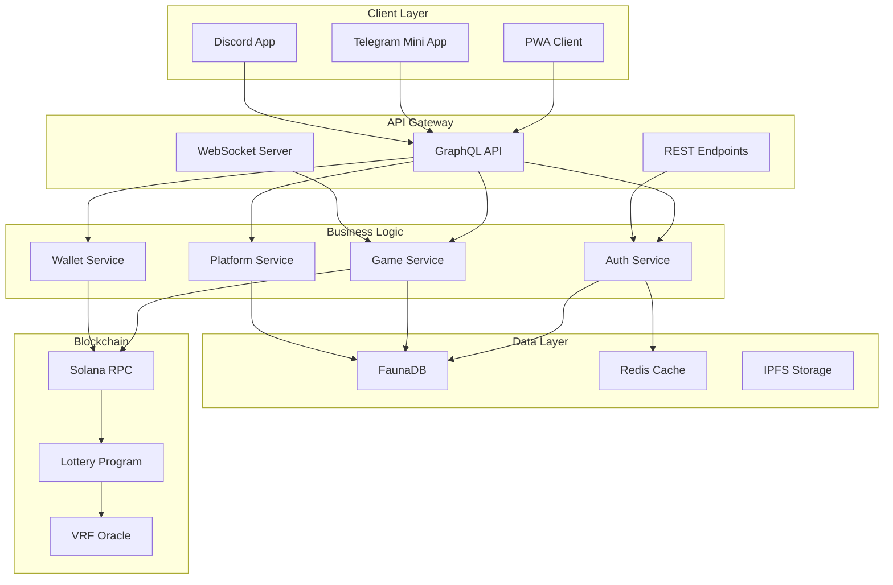
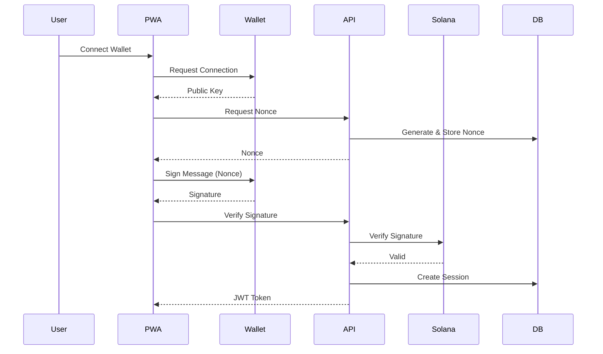
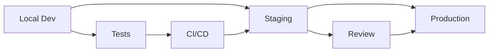
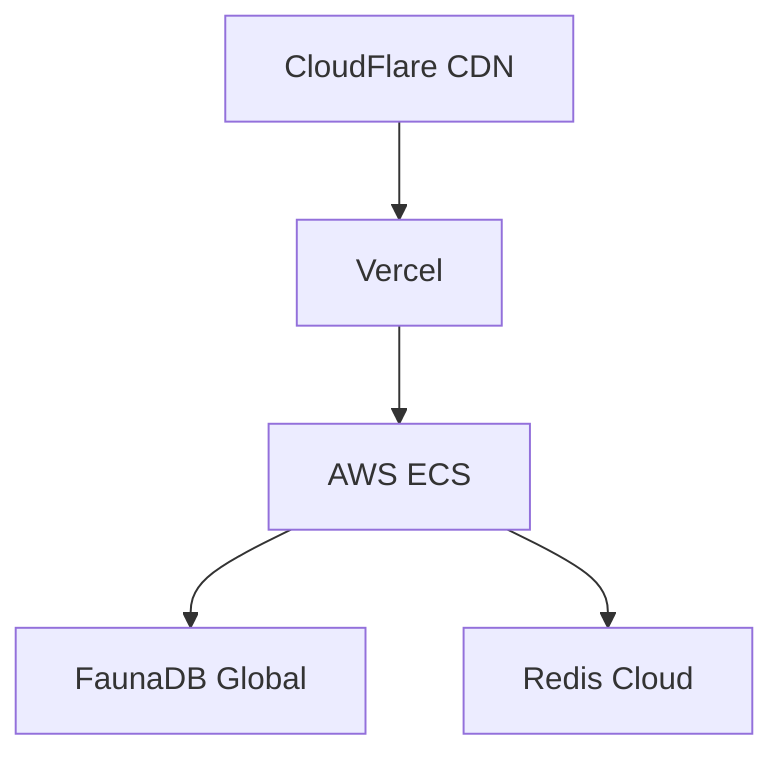

# Solana VRF Lottery PWA - Architecture Document

## 1. Executive Summary

This document outlines the comprehensive architecture for transforming the existing Telegram lottery bot into a modern Progressive Web Application (PWA) that supports multiple platforms while maintaining the core Solana blockchain functionality.

## 2. System Architecture Overview

### 2.1 High-Level Architecture



### 2.2 Component Architecture

#### Frontend Architecture
```
pwa/
├── src/
│   ├── app/                    # Next.js App Router
│   │   ├── (public)/          # Public routes
│   │   ├── (auth)/            # Authenticated routes
│   │   ├── (platform)/        # Platform-specific routes
│   │   │   ├── telegram/      # Telegram-specific
│   │   │   └── discord/       # Discord-specific
│   │   └── api/               # API routes
│   ├── components/
│   │   ├── common/            # Shared components
│   │   ├── lottery/           # Game components
│   │   ├── wallet/            # Wallet components
│   │   └── platform/          # Platform adapters
│   ├── lib/
│   │   ├── graphql/          # GraphQL client
│   │   ├── solana/           # Blockchain utilities
│   │   ├── platforms/        # Platform SDKs
│   │   └── utils/            # Helpers
│   └── stores/               # State management
```

#### Backend Architecture
```
api/
├── src/
│   ├── graphql/
│   │   ├── schema/           # Type definitions
│   │   ├── resolvers/        # Business logic
│   │   └── datasources/      # Data access
│   ├── services/
│   │   ├── auth/            # Authentication
│   │   ├── game/            # Game logic
│   │   ├── wallet/          # Wallet operations
│   │   └── platform/        # Platform integration
│   ├── middleware/          # Express middleware
│   └── utils/              # Utilities
```

## 3. Data Architecture

### 3.1 FaunaDB Schema

```graphql
# User Collection
type User {
  id: ID!
  walletAddress: String! @unique
  username: String
  platforms: [PlatformConnection!]
  stats: UserStats!
  createdAt: Time!
  updatedAt: Time!
}

type PlatformConnection {
  platform: Platform!
  platformId: String!
  metadata: JSON
  connectedAt: Time!
}

type UserStats {
  gamesPlayed: Int!
  gamesWon: Int!
  totalWinnings: Float!
  lastPlayedAt: Time
}

# Game Collection
type Game {
  id: ID!
  gameId: String! @unique
  status: GameStatus!
  entryFee: Float!
  prizePool: Float!
  maxPlayers: Int!
  players: [Player!]
  winner: Player
  startedAt: Time!
  endedAt: Time
  transactionSignature: String
}

type Player {
  user: User!
  joinedAt: Time!
  transactionSignature: String!
  eliminated: Boolean!
  eliminatedAt: Time
}

# Transaction Collection
type Transaction {
  id: ID!
  signature: String! @unique
  type: TransactionType!
  user: User!
  game: Game
  amount: Float!
  status: TransactionStatus!
  createdAt: Time!
  confirmedAt: Time
}

enum Platform {
  WEB
  TELEGRAM
  DISCORD
}

enum GameStatus {
  WAITING
  ACTIVE
  COMPLETED
  CANCELLED
}

enum TransactionType {
  GAME_ENTRY
  PRIZE_CLAIM
  REFUND
}

enum TransactionStatus {
  PENDING
  CONFIRMED
  FAILED
}
```

### 3.2 Redis Data Structure

```typescript
// Session Storage
interface Session {
  userId: string;
  walletAddress: string;
  platform: Platform;
  expiresAt: number;
}

// Game State Cache
interface GameCache {
  gameId: string;
  players: string[];
  status: GameStatus;
  lastUpdated: number;
}

// Real-time Subscriptions
interface Subscription {
  connectionId: string;
  userId: string;
  subscriptions: string[];
}
```

## 4. Security Architecture

### 4.1 Authentication Flow



### 4.2 Security Measures

1. **Authentication**
   - SIWS (Sign-In with Solana) for primary auth
   - Platform-specific OAuth for secondary auth
   - JWT tokens with short expiration
   - Refresh token rotation

2. **API Security**
   - Rate limiting per user and IP
   - Request signing for sensitive operations
   - CORS with strict origin validation
   - Input validation and sanitization

3. **Transaction Security**
   - Client-side simulation before submission
   - Server-side validation
   - Retry logic with exponential backoff
   - Transaction status tracking

4. **Data Protection**
   - Encryption at rest (FaunaDB)
   - TLS for all communications
   - PII data minimization
   - GDPR compliance

## 5. Platform Integration Architecture

### 5.1 Telegram Mini App Integration

```typescript
interface TelegramIntegration {
  // Initialization
  initTelegramWebApp(): void;
  
  // Authentication
  validateTelegramUser(initData: string): Promise<TelegramUser>;
  linkTelegramAccount(userId: string, telegramId: string): Promise<void>;
  
  // UI Adaptation
  applyTelegramTheme(): void;
  handleBackButton(): void;
  
  // Features
  sendNotification(userId: string, message: string): Promise<void>;
  processPayment(amount: number): Promise<PaymentResult>;
}
```

### 5.2 Discord App Integration

```typescript
interface DiscordIntegration {
  // OAuth Flow
  initiateOAuth(): Promise<string>;
  handleCallback(code: string): Promise<DiscordUser>;
  
  // Embedded App
  setupIframeMessaging(): void;
  handleDiscordCommands(): void;
  
  // Guild Features
  getGuildInfo(guildId: string): Promise<Guild>;
  createGuildGame(guildId: string, config: GameConfig): Promise<Game>;
  
  // Permissions
  checkUserPermissions(userId: string, guildId: string): Promise<Permissions>;
}
```

### 5.3 Platform Detection & Routing

```typescript
// Platform detection utility
export function detectPlatform(): Platform {
  if (window.Telegram?.WebApp) return 'telegram';
  if (window.location.ancestorOrigins?.contains('discord.com')) return 'discord';
  return 'web';
}

// Platform-specific routing
export function getPlatformRoute(platform: Platform, route: string): string {
  const platformRoutes = {
    telegram: `/telegram${route}`,
    discord: `/discord${route}`,
    web: route
  };
  return platformRoutes[platform];
}
```

## 6. Performance Architecture

### 6.1 Optimization Strategies

1. **Frontend Optimization**
   - Code splitting by route
   - Dynamic imports for heavy components
   - Image optimization with Next.js Image
   - Font subsetting
   - Tree shaking

2. **API Optimization**
   - DataLoader for N+1 query prevention
   - Query complexity analysis
   - Response caching
   - Field-level permissions

3. **Caching Strategy**
   - Redis for session data (TTL: 24h)
   - CloudFlare for static assets
   - GraphQL response caching
   - Stale-while-revalidate for dynamic data

### 6.2 Scalability Considerations

```yaml
# Kubernetes deployment example
apiVersion: apps/v1
kind: Deployment
metadata:
  name: lottery-pwa-api
spec:
  replicas: 3
  selector:
    matchLabels:
      app: lottery-api
  template:
    spec:
      containers:
      - name: api
        image: lottery-pwa-api:latest
        resources:
          requests:
            memory: "256Mi"
            cpu: "250m"
          limits:
            memory: "512Mi"
            cpu: "500m"
```

## 7. Development Architecture

### 7.1 Development Workflow



### 7.2 Environment Configuration

```typescript
// Environment-specific configuration
export const config = {
  development: {
    apiUrl: 'http://localhost:4000/graphql',
    solanaRpc: 'https://api.devnet.solana.com',
    programId: 'DevnetProgramId...',
  },
  staging: {
    apiUrl: 'https://staging-api.lottery-pwa.com/graphql',
    solanaRpc: 'https://api.devnet.solana.com',
    programId: 'DevnetProgramId...',
  },
  production: {
    apiUrl: 'https://api.lottery-pwa.com/graphql',
    solanaRpc: 'https://api.mainnet-beta.solana.com',
    programId: 'MainnetProgramId...',
  }
};
```

## 8. Monitoring & Analytics Architecture

### 8.1 Monitoring Stack

```yaml
monitoring:
  - service: Sentry
    purpose: Error tracking
    integration: Frontend & Backend
    
  - service: Grafana
    purpose: Metrics visualization
    datasource: Prometheus
    
  - service: Datadog
    purpose: APM & Infrastructure
    features:
      - Request tracing
      - Database monitoring
      - Custom metrics
      
  - service: LogRocket
    purpose: Session replay
    platform: Frontend only
```

### 8.2 Key Metrics

1. **Performance Metrics**
   - Page load time
   - Time to interactive
   - API response time
   - Transaction confirmation time

2. **Business Metrics**
   - Daily active users
   - Games created/completed
   - Transaction volume
   - Platform distribution

3. **Technical Metrics**
   - Error rate
   - API availability
   - Cache hit rate
   - WebSocket connections

## 9. Deployment Architecture

### 9.1 Infrastructure



### 9.2 CI/CD Pipeline

```yaml
# GitHub Actions example
name: Deploy
on:
  push:
    branches: [main]

jobs:
  test:
    runs-on: ubuntu-latest
    steps:
      - uses: actions/checkout@v3
      - run: pnpm install
      - run: pnpm test
      - run: pnpm build

  deploy:
    needs: test
    runs-on: ubuntu-latest
    steps:
      - uses: actions/checkout@v3
      - uses: vercel/action@v3
        with:
          vercel-token: ${{ secrets.VERCEL_TOKEN }}
```

## 10. Migration Strategy

### 10.1 Phased Migration

1. **Phase 1**: Deploy PWA alongside existing bot
2. **Phase 2**: Redirect web users to PWA
3. **Phase 3**: Integrate Telegram Mini App
4. **Phase 4**: Add Discord integration
5. **Phase 5**: Deprecate old web dashboard

### 10.2 Data Migration

```typescript
// Migration script example
async function migrateUsers() {
  const existingUsers = await getExistingUsers();
  
  for (const user of existingUsers) {
    await faunaClient.query(
      Create(Collection('users'), {
        data: {
          walletAddress: user.wallet_address,
          username: user.username,
          platforms: [{
            platform: 'TELEGRAM',
            platformId: user.telegram_id,
            connectedAt: Now()
          }],
          stats: {
            gamesPlayed: user.games_played,
            gamesWon: user.games_won,
            totalWinnings: user.total_winnings
          },
          createdAt: user.created_at,
          updatedAt: Now()
        }
      })
    );
  }
}
```

## 11. Conclusion

This architecture provides a solid foundation for transforming the Telegram lottery bot into a modern, scalable PWA that works across multiple platforms while maintaining security and performance.